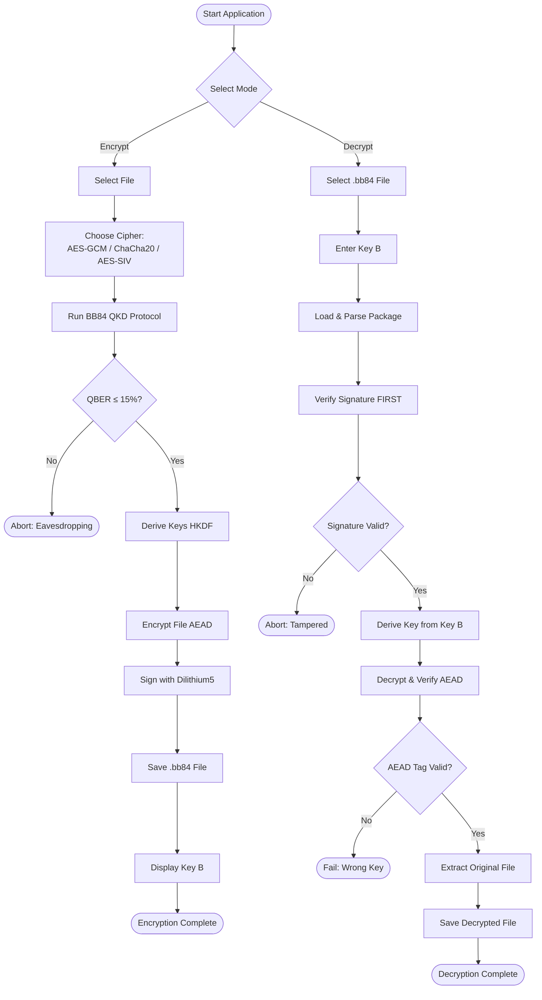
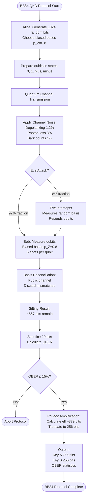
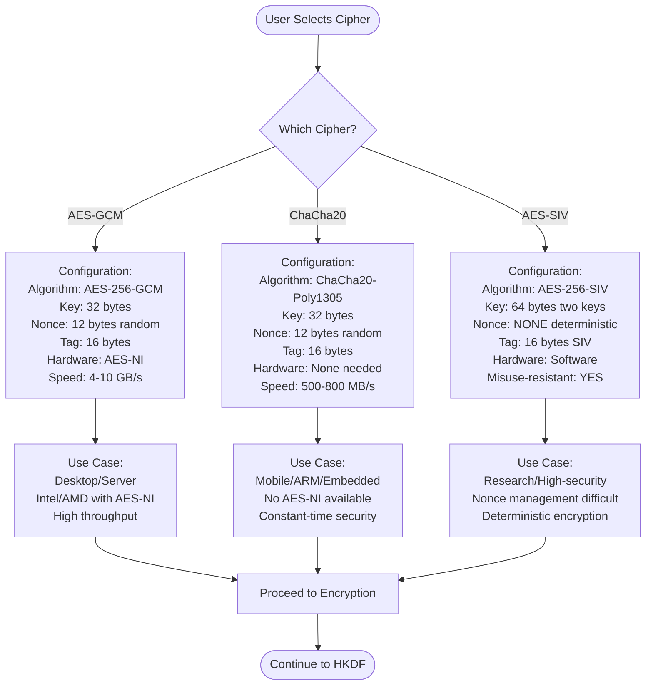
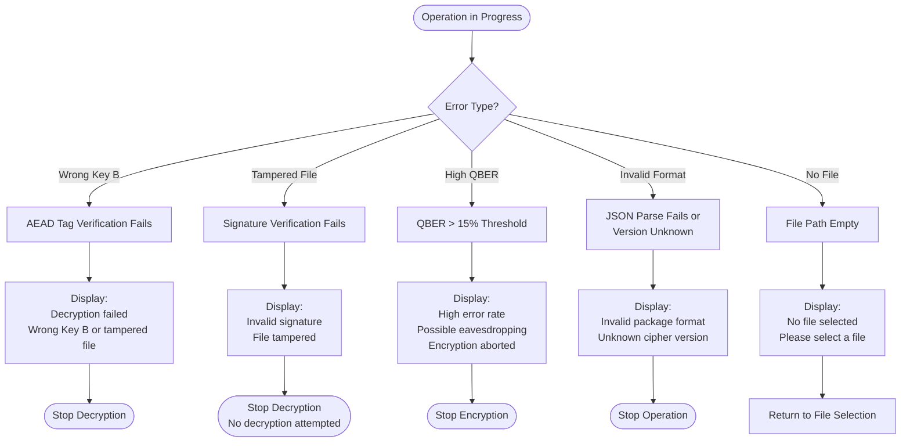
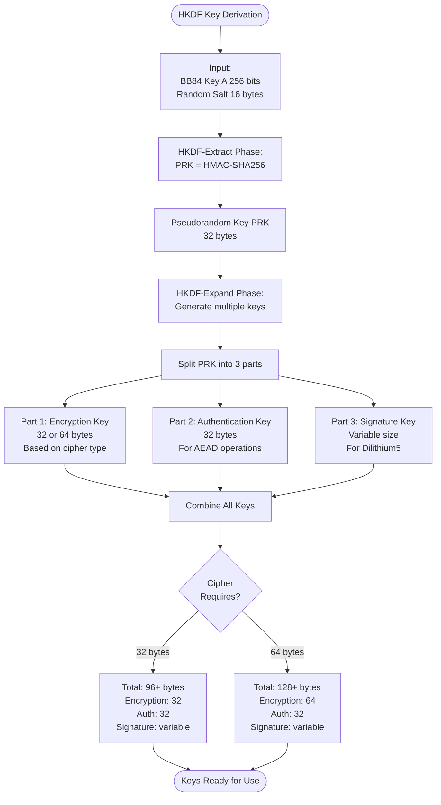

# BB84 Quantum Encryption Tool - Activity Diagram

## Complete System Activity Diagram

This document contains Mermaid activity diagrams for the BB84 Quantum Encryption Tool showing all decision points, processes, and cipher branches.

---

## Simplified High-Level Activity Diagram



---

## BB84 Protocol Detailed Subprocess



---

## Cipher Selection Decision Tree



---

## Error Handling Flow



---

## HKDF Key Derivation Subprocess



---

## Rendering Instructions

### For GitHub:
1. Copy this file to your repository
2. GitHub will automatically render Mermaid diagrams
3. View the file in GitHub's web interface

### For Local Rendering:
**Option 1: VS Code**
```bash
# Install Mermaid extension
code --install-extension bierner.markdown-mermaid
```

**Option 2: Online Mermaid Editor**
- Visit: https://mermaid.live/
- Copy any diagram code block
- Paste and edit in real-time

**Option 3: Export as PNG/SVG**
```bash
# Install Mermaid CLI
npm install -g @mermaid-js/mermaid-cli

# Generate PNG
mmdc -i ACTIVITY_DIAGRAM.md -o activity_diagram.png

# Generate SVG
mmdc -i ACTIVITY_DIAGRAM.md -o activity_diagram.svg
```

---

## Diagram Legend

### Node Types:
- **Rounded Rectangle** `([text])` = Start/End points
- **Rectangle** `[text]` = Process/Action
- **Diamond** `{text?}` = Decision point
- **Parallelogram** (styled) = Input/Output
- **Hexagon** (styled) = Subprocess

### Arrow Types:
- **Solid line** `-->` = Normal flow
- **Dashed line** `-.->` = Optional/Conditional flow

---

## Diagram Summary

1. **Simplified High-Level** - Overview of encryption and decryption flows
2. **BB84 Protocol Subprocess** - Detailed 8-step quantum key distribution
3. **Cipher Selection Decision Tree** - Configuration for each encryption mode
4. **Error Handling Flow** - All error paths and recovery logic
5. **HKDF Subprocess** - Key derivation process

All diagrams use standard Mermaid syntax compatible with GitHub rendering.

---

**File Status:** ✅ Ready for rendering
**Total Diagrams:** 5 activity diagrams
**Format:** Mermaid flowchart syntax
**Compatibility:** GitHub, GitLab, VS Code, Mermaid Live Editor
