# BB84 Quantum Encryption Tool - Activity Diagram

## Complete System Activity Diagram

This diagram shows the complete workflow of the BB84 Quantum Encryption Tool with all decision points, processes, and cipher branches.

---

## Main Activity Diagram (Mermaid Syntax)


---

## Simplified High-Level Activity Diagram

```mermaid
flowchart TD
    Start([Start Application]) --> Mode{Select Mode}
    
    Mode -->|Encrypt| E1[Select File]
    Mode -->|Decrypt| D1[Select .bb84 File]
    
    E1 --> E2[Choose Cipher:<br/>AES-GCM / ChaCha20 / AES-SIV]
    E2 --> E3[Run BB84 QKD Protocol]
    E3 --> E4{QBER ≤ 15%?}
    E4 -->|No| E_Abort([Abort: Eavesdropping])
    E4 -->|Yes| E5[Derive Keys HKDF]
    E5 --> E6[Encrypt File AEAD]
    E6 --> E7[Sign with Dilithium5]
    E7 --> E8[Save .bb84 File]
    E8 --> E9[Display Key B]
    E9 --> E_End([Encryption Complete])
    
    D1 --> D2[Enter Key B]
    D2 --> D3[Load & Parse Package]
    D3 --> D4[Verify Signature FIRST]
    D4 --> D5{Signature Valid?}
    D5 -->|No| D_Abort([Abort: Tampered])
    D5 -->|Yes| D6[Derive Key from Key B]
    D6 --> D7[Decrypt & Verify AEAD]
    D7 --> D8{AEAD Tag Valid?}
    D8 -->|No| D_Fail([Fail: Wrong Key])
    D8 -->|Yes| D9[Extract Original File]
    D9 --> D10[Save Decrypted File]
    D10 --> D_End([Decryption Complete])
    
    style Start fill:#90EE90
    style E_End fill:#FFD700
    style D_End fill:#FFD700
    style E_Abort fill:#FF6B6B
    style D_Abort fill:#FF6B6B
    style D_Fail fill:#FF6B6B
```



---

## BB84 Protocol Detailed Subprocess

```mermaid
flowchart TD
    BB84_Start([BB84 QKD Protocol Start]) --> Step1[Alice: Generate 1024 random bits<br/>Choose biased bases p_Z=0.8]
    Step1 --> Step2[Prepare qubits in states:<br/>|0⟩ |1⟩ |+⟩ |−⟩]
    Step2 --> Step3[Quantum Channel Transmission]
    
    Step3 --> Noise[Apply Channel Noise:<br/>Depolarizing 1.2%<br/>Photon loss 3%<br/>Dark counts 1%]
    
    Noise --> Attack{Eve Attack?}
    Attack -->|8% fraction| Eve[Eve intercepts<br/>Measures random basis<br/>Resends qubits]
    Attack -->|92% fraction| Bob
    Eve --> Bob
    
    Bob[Bob: Measure qubits<br/>Biased bases p_Z=0.8<br/>6 shots per qubit]
    Bob --> Recon[Basis Reconciliation:<br/>Public channel<br/>Discard mismatched]
    
    Recon --> Sift[Sifting Result:<br/>~667 bits remain]
    Sift --> Sample[Sacrifice 20 bits<br/>Calculate QBER]
    
    Sample --> Check{QBER ≤ 15%?}
    Check -->|No| Abort([Abort Protocol])
    Check -->|Yes| Privacy[Privacy Amplification:<br/>Calculate ell ~379 bits<br/>Truncate to 256 bits]
    
    Privacy --> Output[Output:<br/>Key A 256 bits<br/>Key B 256 bits<br/>QBER statistics]
    Output --> BB84_End([BB84 Protocol Complete])
    
    style BB84_Start fill:#90EE90
    style BB84_End fill:#FFD700
    style Abort fill:#FF6B6B
    style Noise fill:#FFA07A
    style Eve fill:#FF6347
```

---

## Cipher Selection Decision Tree


---

## Error Handling Flow


---

## HKDF Key Derivation Subprocess


---

## Rendering Instructions

### For GitHub:
1. Copy this entire file to your repository
2. GitHub will automatically render Mermaid diagrams
3. View the file in GitHub's web interface

### For Local Rendering:
**Option 1: VS Code**
```bash
# Install Mermaid extension
code --install-extension bierner.markdown-mermaid
```

**Option 2: Online Mermaid Editor**
- Visit: https://mermaid.live/
- Copy any diagram code block
- Paste and edit in real-time

**Option 3: Export as PNG/SVG**
```bash
# Install Mermaid CLI
npm install -g @mermaid-js/mermaid-cli

# Generate PNG
mmdc -i ACTIVITY_DIAGRAM.md -o activity_diagram.png

# Generate SVG
mmdc -i ACTIVITY_DIAGRAM.md -o activity_diagram.svg
```

---

## Diagram Legend

### Node Types:
- **Rounded Rectangle** `([text])` = Start/End points
- **Rectangle** `[text]` = Process/Action
- **Diamond** `{text?}` = Decision point
- **Parallelogram** (styled) = Input/Output
- **Hexagon** (styled) = Subprocess

### Color Coding:
- 🟢 **Green** = Start points
- 🟡 **Gold** = Successful completion
- 🔴 **Red** = Error/Abort endpoints
- 🔵 **Blue** = Process nodes
- 🟣 **Purple** = Optional operations
- 🟠 **Orange** = Subprocesses

### Arrow Types:
- **Solid line** `-->` = Normal flow
- **Dashed line** `-.->` = Optional/Conditional flow

---

## Notes

1. **Main Diagram** shows complete end-to-end flow with all three cipher branches
2. **Simplified Diagram** shows high-level overview without technical details
3. **BB84 Subprocess** shows detailed quantum protocol steps
4. **Cipher Decision Tree** shows configuration for each encryption mode
5. **Error Handling** shows all error paths and recovery logic
6. **HKDF Subprocess** shows key derivation process

All diagrams are fully functional Mermaid syntax and can be:
- Rendered in GitHub/GitLab
- Exported to PNG/SVG/PDF
- Edited in Mermaid Live Editor
- Embedded in documentation

---

**File Status:** ✅ Ready for rendering
**Total Diagrams:** 6 comprehensive activity diagrams
**Format:** Mermaid flowchart syntax
**Compatibility:** GitHub, GitLab, VS Code, Mermaid Live Editor
